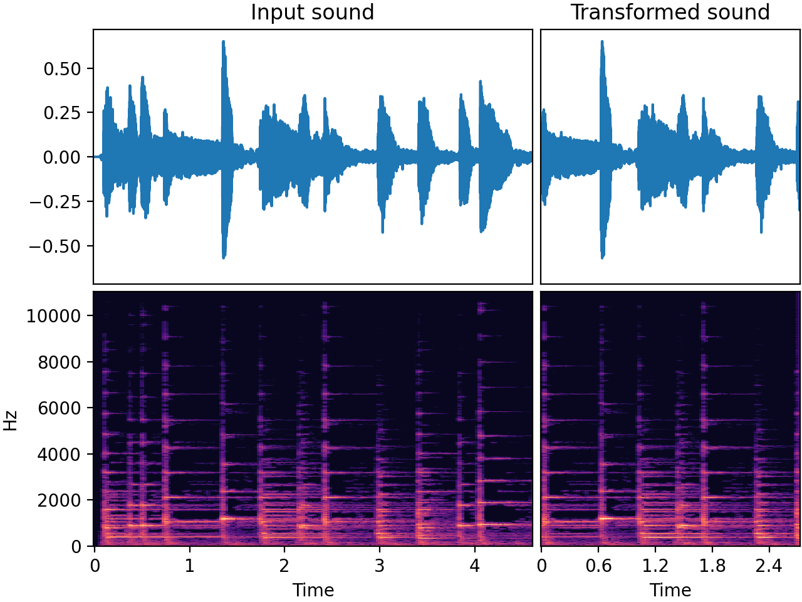

# `AdjustDuration`

_Added in v0.30.0_

Trim or pad the audio to the specified length/duration in samples or seconds. If the
input sound is longer than the target duration, pick a random offset and crop the
sound to the target duration. If the input sound is shorter than the target
duration, pad the sound so the duration matches the target duration.

This transform can be useful if you need audio with constant length, e.g. as input to a
machine learning model. The reason for varying audio clip lengths can be e.g.

* the nature of the audio dataset (different audio clips have different lengths)
* data augmentation transforms that change the lengths (e.g. time stretching or
 convolving with impulse responses without cutting the tail)

## Input-output example

Here we input an audio clip and remove a part of the start and the end, so the length of the result matches the specified target length.



| Input sound                                                                           | Transformed sound                                                                           |
|---------------------------------------------------------------------------------------|---------------------------------------------------------------------------------------------|
| <audio controls><source src="../AdjustDuration_input.flac" type="audio/flac"></audio> | <audio controls><source src="../AdjustDuration_transformed.flac" type="audio/flac"></audio> | 

## Usage examples

=== "Target length in samples"

    ```python
    from audiomentations import AdjustDuration
    
    transform = AdjustDuration(duration_samples=60000, p=1.0)
    
    augmented_sound = transform(my_waveform_ndarray, sample_rate=16000)
    ```

=== "Target duration in seconds"

    ```python
    from audiomentations import AdjustDuration

    transform = AdjustDuration(duration_seconds=3.75, p=1.0)
    
    augmented_sound = transform(my_waveform_ndarray, sample_rate=16000)
    ```

# AdjustDuration API

[`duration_samples`](#duration_samples){ #duration_samples }: `int` • range: [0, ∞)
:   :octicons-milestone-24: Target duration in number of samples.

[`duration_seconds`](#duration_seconds){ #duration_seconds }: `float` • range: [0.0, ∞)
:   :octicons-milestone-24: Target duration in seconds.

[`padding_mode`](#padding_mode){ #padding_mode }: `str` • choices: `"silence"`, `"wrap"`, `"reflect"`
:   :octicons-milestone-24: Default: `"silence"`. Padding mode. Only used when audio input is shorter than the target duration.
    * `"silence"`: Pads with zeros (silence).
    * `"wrap"`: Pads by wrapping the existing audio content.
    * `"reflect"`: Pads by reflecting the audio at the boundaries.

[`padding_position`](#padding_position){ #padding_position }: `str` • choices: `"start"`, `"end"`
:   :octicons-milestone-24: Default: `"end"`. The position of the inserted/added padding. Only used when audio input is shorter than the target duration.

[`p`](#p){ #p }: `float` • range: [0.0, 1.0]
:   :octicons-milestone-24: Default: `0.5`. The probability of applying this transform.

## Source code :octicons-mark-github-16:

[audiomentations/augmentations/adjust_duration.py :octicons-link-external-16:](https://github.com/iver56/audiomentations/blob/main/audiomentations/augmentations/adjust_duration.py){target=_blank}
