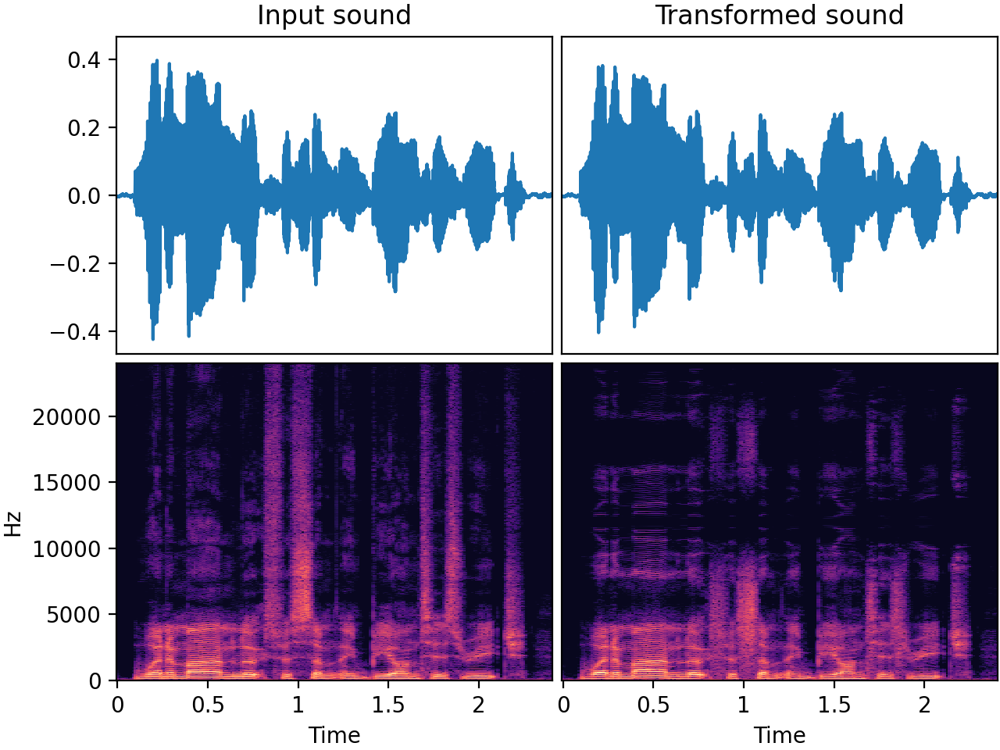

# `Aliasing`

_To be added in v0.35.0_

Downsample the audio to a lower sample rate by linear interpolation, without low-pass
filtering it first, resulting in aliasing artifacts. You get aliasing artifacts when
there is high-frequency audio in the input audio that falls above the nyquist frequency
of the chosen target sample rate. Audio with frequencies above the nyquist frequency
cannot be reproduced accurately and get "reflected"/mirrored to other frequencies.

After the downsampling, the signal gets upsampled to the original signal again, so the
length of the output becomes the same as the length of the input.

For more information, see

* [Sample rate reduction :octicons-link-external-16:](https://en.wikipedia.org/wiki/Bitcrusher#Sample_rate_reduction){target=_blank} on Wikipedia
* [Intro to downsampling :octicons-link-external-16:](http://gdsp.hf.ntnu.no/lessons/1/3/){target=_blank} by NTNU, Department of Music, Music Technology. Note: that article describes a slightly different downsampling technique, called sample-and-hold, while audiomentations implements linear interpolation. However, both methods lead to aliasing artifacts.

## Input-output example

Here we target a sample rate of 12000 Hz. Note the vertical mirroring in the spectrogram in the transformed sound.



| Input sound                                                                     | Transformed sound                                                                     |
|---------------------------------------------------------------------------------|---------------------------------------------------------------------------------------|
| <audio controls><source src="../Aliasing_input.flac" type="audio/flac"></audio> | <audio controls><source src="../Aliasing_transformed.flac" type="audio/flac"></audio> | 

## Usage example

```python
from audiomentations import Aliasing

transform = Aliasing(min_sample_rate=8000, max_sample_rate=30000, p=1.0)

augmented_sound = transform(my_waveform_ndarray, sample_rate=44100)
```

# Aliasing API

[`min_sample_rate`](#min_sample_rate){ #min_sample_rate }: `int` • unit: Hz • range: [2, ∞)
:   :octicons-milestone-24: Minimum target sample rate to downsample to

[`max_sample_rate`](#max_sample_rate){ #max_sample_rate }: `int` • unit: Hz • range: [2, ∞)
:   :octicons-milestone-24: Maximum target sample rate to downsample to

[`p`](#p){ #p }: `float` • range: [0.0, 1.0]
:   :octicons-milestone-24: Default: `0.5`. The probability of applying this transform.
