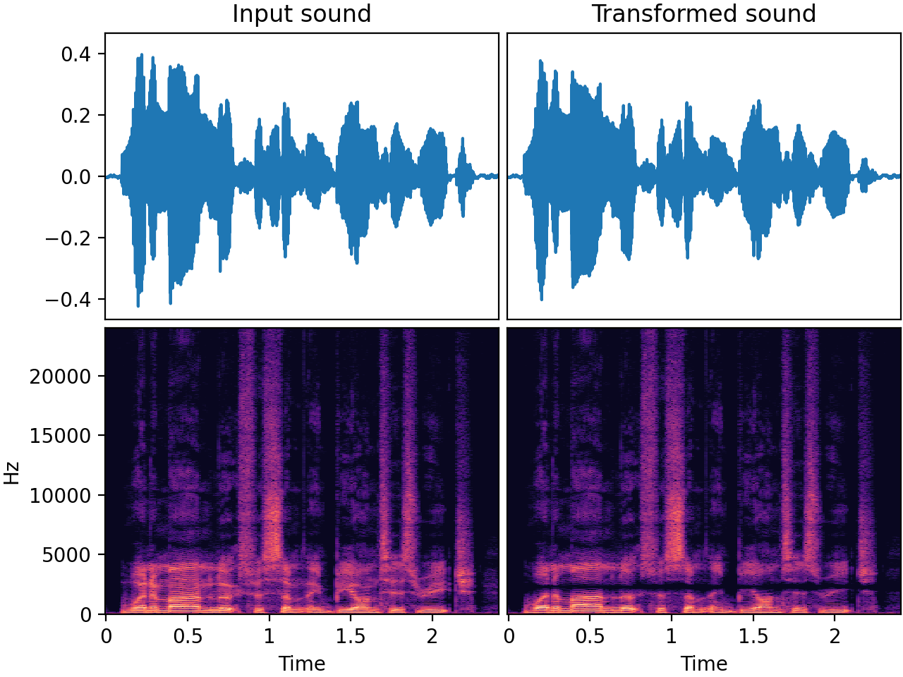

# `BandStopFilter`

_Added in v0.21.0_

Apply band-stop filtering to the input audio. Also known as notch filter or
band reject filter. It relates to the frequency mask idea in the [SpecAugment paper :octicons-link-external-16:](https://arxiv.org/abs/1904.08779).
Center frequency gets picked in mel space, so it is somewhat aligned with human hearing,
which is not linear. Filter steepness (6/12/18... dB / octave) is parametrized. Can also
be set for zero-phase filtering (will result in a 6 dB drop at cutoffs).

Applying band-stop filtering as data augmentation during model training can aid in
preventing overfitting to specific frequency relationships, helping to make the model
robust to diverse audio environments and scenarios, where frequency losses can occur.

## Input-output example

Here we input a speech recording and apply `BandStopFilter` with a center
frequency of 2500 Hz and a bandwidth fraction of 0.8, which means that the bandwidth in
this example is 2000 Hz, so the low frequency cutoff is 1500 Hz and the high frequency
cutoff is 3500 Hz. One can see in the spectrogram of the transformed sound that the band
stop filter has attenuated this frequency range. If you listen to the audio example, you
can hear that the timbre is different in the transformed sound than in the original.

| Input sound                                                                           | Transformed sound                                                                           |
|---------------------------------------------------------------------------------------|---------------------------------------------------------------------------------------------|
| <audio controls><source src="../BandStopFilter_input.flac" type="audio/flac"></audio> | <audio controls><source src="../BandStopFilter_transformed.flac" type="audio/flac"></audio> | 

# BandStopFilter API

[`min_center_freq`](#min_center_freq){ #min_center_freq }: `float` • unit: hertz
:   :octicons-milestone-24: Default: `200.0`. Minimum center frequency in hertz

[`max_center_freq`](#max_center_freq){ #max_center_freq }: `float` • unit: hertz
:   :octicons-milestone-24: Default: `4000.0`. Maximum center frequency in hertz

[`min_bandwidth_fraction`](#min_bandwidth_fraction){ #min_bandwidth_fraction }: `float`
:   :octicons-milestone-24: Default: `0.5`. Minimum bandwidth fraction relative to center frequency

[`max_bandwidth_fraction`](#max_bandwidth_fraction){ #max_bandwidth_fraction }: `float`
:   :octicons-milestone-24: Default: `1.99`. Maximum bandwidth fraction relative to center frequency

[`min_rolloff`](#min_rolloff){ #min_rolloff }: `int` • unit: Decibels/octave
:   :octicons-milestone-24: Default: `12`. Minimum filter roll-off (in dB/octave).
    Must be a multiple of 6 (or 12 if `zero_phase` is `True`)

[`max_rolloff`](#max_rolloff){ #max_rolloff }: `int` • unit: Decibels/octave
:   :octicons-milestone-24: Default: `24`. Maximum filter roll-off (in dB/octave)
    Must be a multiple of 6 (or 12 if `zero_phase` is `True`)

[`zero_phase`](#zero_phase){ #zero_phase }: `bool`
:   :octicons-milestone-24: Default: `False`. Whether filtering should be zero phase.
    When this is set to `True`, it will not affect the phase of the input signal but will
    sound 3 dB lower at the cutoff frequency compared to the non-zero phase case (6 dB
    vs. 3 dB). Additionally, it is twice as slow as the non-zero phase case. If
    you absolutely want no phase distortions (e.g. want to augment an audio file with
    lots of transients, like a drum track), set this to `True`.

[`p`](#p){ #p }: `float` • range: [0.0, 1.0]
:   :octicons-milestone-24: Default: `0.5`. The probability of applying this transform.

## Source code :octicons-mark-github-16:

[audiomentations/augmentations/band_stop_filter.py :octicons-link-external-16:](https://github.com/iver56/audiomentations/blob/main/audiomentations/augmentations/band_stop_filter.py){target=_blank}
