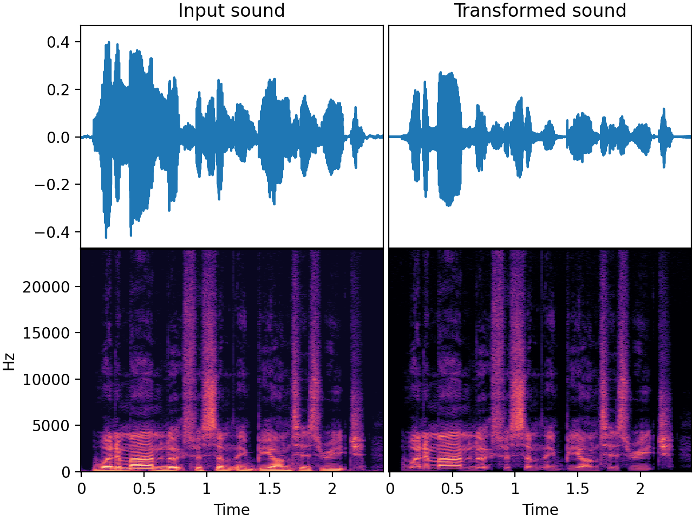

# `HighPassFilter`

_Added in v0.18.0, updated in v0.21.0_

Apply high-pass filtering to the input audio of parametrized filter steepness (6/12/18... dB / octave).
Can also be set for zero-phase filtering (will result in a 6 dB drop at cutoff).

## Input-output example

Here we input a high-quality speech recording and apply `HighPassFilter` with a cutoff
frequency of 1000 Hz, a filter roll-off of 12 dB/octave and with `zero_phase=False`.
One can see in the spectrogram below that the low frequencies (at the bottom)
are attenuated in the output. This change is not immediately obvious when just looking
at the spectrogram with linear frequency axis, but if you listen to the transformed sound,
you'll immediately hear that all the bass/"meat"/warmth/body is gone.



| Input sound                                                                           | Transformed sound                                                                           |
|---------------------------------------------------------------------------------------|---------------------------------------------------------------------------------------------|
| <audio controls><source src="../HighPassFilter_input.flac" type="audio/flac"></audio> | <audio controls><source src="../HighPassFilter_transformed.flac" type="audio/flac"></audio> | 

## Usage example

```python
from audiomentations import HighPassFilter

transform = HighPassFilter(min_cutoff_freq=200.0, max_cutoff_freq=1500.0, p=1.0)

augmented_sound = transform(my_waveform_ndarray, sample_rate=48000)
```

# HighPassFilter API

[`min_cutoff_freq`](#min_cutoff_freq){ #min_cutoff_freq }: `float` • unit: hertz • range: (0.0, `max_cutoff_freq`]
:   :octicons-milestone-24: Default: `20.0`. Minimum cutoff frequency

[`max_cutoff_freq`](#max_cutoff_freq){ #max_cutoff_freq }: `float` • unit: hertz • range: [`min_cutoff_freq`, sample_rate/2)
:   :octicons-milestone-24: Default: `2400.0`. Maximum cutoff frequency

[`min_rolloff`](#min_rolloff){ #min_rolloff }: `float` • unit: Decibels/octave
:   :octicons-milestone-24: Default: `12`. Minimum filter roll-off (in dB/octave).
    Must be a multiple of 6 (or 12 if `zero_phase` is `True`)

[`max_rolloff`](#max_rolloff){ #max_rolloff }: `float` • unit: Decibels/octave
:   :octicons-milestone-24: Default: `24`. Maximum filter roll-off (in dB/octave).
    Must be a multiple of 6 (or 12 if `zero_phase` is `True`)

[`zero_phase`](#zero_phase){ #zero_phase }: `bool`
:   :octicons-milestone-24: Default: `False`. Whether filtering should be zero phase.
    When this is set to `True`, it will not affect the phase of the input signal but will
    sound 3 dB lower at the cutoff frequency compared to the non-zero phase case (6 dB
    vs. 3 dB). Additionally, it is twice as slow as the non-zero phase case. If
    you absolutely want no phase distortions (e.g. want to augment an audio file with
    lots of transients, like a drum track), set this to `True`.

[`p`](#p){ #p }: `float` • range: [0.0, 1.0]
:   :octicons-milestone-24: Default: `0.5`. The probability of applying this transform.

## Source code :octicons-mark-github-16:

[audiomentations/augmentations/high_pass_filter.py :octicons-link-external-16:](https://github.com/iver56/audiomentations/blob/main/audiomentations/augmentations/high_pass_filter.py){target=_blank}
