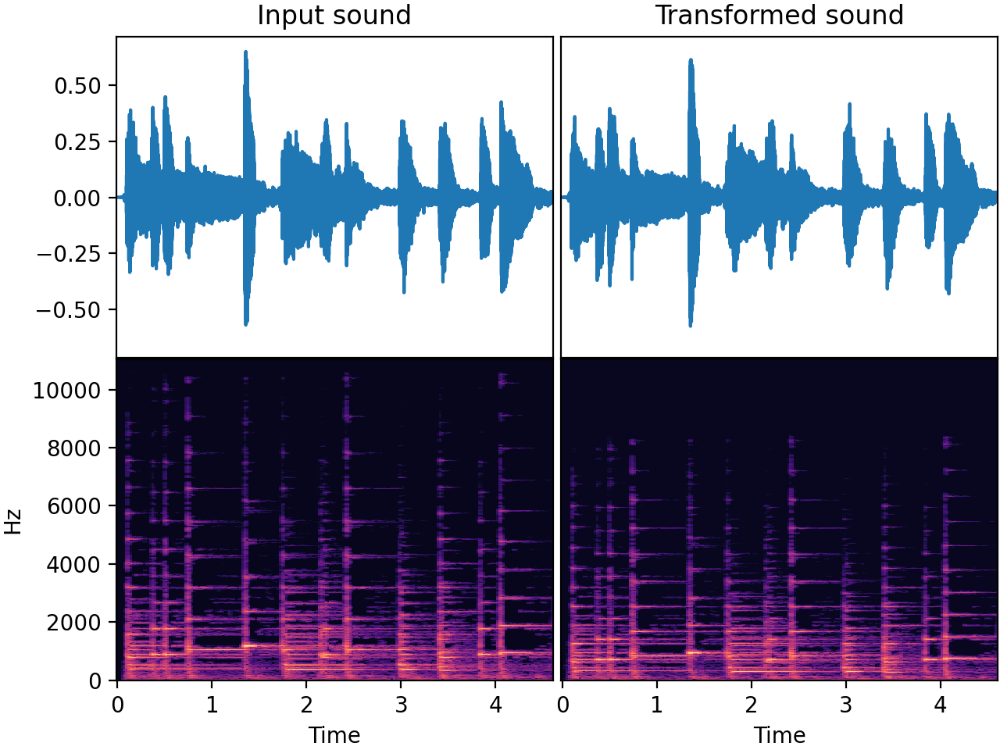

# `PitchShift`

_Added in v0.4.0_

Pitch shift the sound up or down without changing the tempo.

You can choose between method="signalsmith_stretch" and method="librosa_phase_vocoder". If you need other pitch shifting methods, consider the following alternatives:

* [Rubber Band library](https://breakfastquay.com/rubberband/)
* [https://github.com/KAIST-MACLab/PyTSMod](https://github.com/KAIST-MACLab/PyTSMod)
* [https://github.com/vinusankars/ESOLA](https://github.com/vinusankars/ESOLA)

## Input-output example

Here we pitch down a piano recording by 4 semitones, using the `signalsmith_stretch` method:



| Input sound                                                                           | Transformed sound                                                                           |
|---------------------------------------------------------------------------------------|---------------------------------------------------------------------------------------------|
| <audio controls><source src="../PitchShift_input.flac" type="audio/flac"></audio> | <audio controls><source src="../PitchShift_transformed.flac" type="audio/flac"></audio> | 

## Usage example

```python
from audiomentations import PitchShift

transform = PitchShift(
    min_semitones=-5.0,
    max_semitones=5.0,
    p=1.0
)

augmented_sound = transform(my_waveform_ndarray, sample_rate=44100)
```

# PitchShift API

[`min_semitones`](#min_semitones){ #min_semitones }: `float` • unit: semitones • range: [-24.0, 24.0]
:   :octicons-milestone-24: Default: `-4.0`. Minimum semitones to shift. A negative number means shift down.

[`max_semitones`](#max_semitones){ #max_semitones }: `float` • unit: semitones • range: [-24.0, 24.0]
:   :octicons-milestone-24: Default: `4.0`. Maximum semitones to shift. A positive number means shift up.

[`backend`](#backend){ #backend }: `str` • choices: `"librosa_phase_vocoder"`, `"signalsmith_stretch"`
:   :octicons-milestone-24: Default: `"signalsmith_stretch"`.

    * `"signalsmith_stretch"`: Use signalsmith-stretch. It is 50-100% faster than librosa_phase_vocoder, and provides significantly higher perceived audio quality.
    * `"librosa_phase_vocoder"`: Use librosa.effects.pitch_shift, which performs time stretching (by phase vocoding) followed by resampling. Pro: Supports any number of channels. Con: phase vocoding can significantly degrade the audio quality by "smearing" transient sounds, altering the timbre of harmonic sounds, and distorting pitch modulations. This may result in a loss of sharpness, clarity, or naturalness in the transformed audio.

[`p`](#p){ #p }: `float` • range: [0.0, 1.0]
:   :octicons-milestone-24: Default: `0.5`. The probability of applying this transform.

## Source code :octicons-mark-github-16:

[audiomentations/augmentations/pitch_shift.py :octicons-link-external-16:](https://github.com/iver56/audiomentations/blob/main/audiomentations/augmentations/pitch_shift.py){target=_blank}
