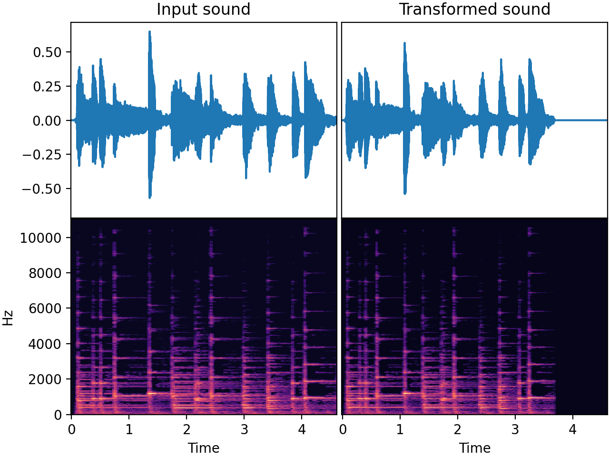

# `TimeStretch`

_Added in v0.2.0_

Change the speed or duration of the signal without changing the pitch. This transform lets you choose
between `method="signalsmith_stretch"` and `method="librosa_phase_vocoder"`. If you need other time stretching methods,
consider the following alternatives:

* [atempo in ffmpeg](https://ffmpeg.org//ffmpeg-all.html#atempo)
* [Rubber Band library](https://breakfastquay.com/rubberband/)
* [https://github.com/KAIST-MACLab/PyTSMod](https://github.com/KAIST-MACLab/PyTSMod)
* [https://github.com/vinusankars/ESOLA](https://github.com/vinusankars/ESOLA)

## Input-output example

In this example we speed up a sound by 25%. This corresponds to a rate of 1.25.



| Input sound                                                                             | Transformed sound                                                                             |
|-----------------------------------------------------------------------------------------|-----------------------------------------------------------------------------------------------|
| <audio controls><source src="../TimeStretch_input.flac" type="audio/flac"></audio> | <audio controls><source src="../TimeStretch_transformed.flac" type="audio/flac"></audio> |

## Usage example

```python
from audiomentations import TimeStretch

transform = TimeStretch(
    min_rate=0.8,
    max_rate=1.25,
    leave_length_unchanged=True,
    p=1.0
)

augmented_sound = transform(my_waveform_ndarray, sample_rate=16000)
```

## TimeStretch API

[`min_rate`](#min_rate){ #min_rate }: `float` • range: [0.1, 10.0]
:   :octicons-milestone-24: Default: `0.8`. Minimum rate of change of total duration of the signal. A rate below 1 means the audio is slowed down.

[`max_rate`](#max_rate){ #max_rate }: `float` • range: [0.1, 10.0]
:   :octicons-milestone-24: Default: `1.25`. Maximum rate of change of total duration of the signal. A rate greater than 1 means the audio is sped up.

[`leave_length_unchanged`](#leave_length_unchanged){ #leave_length_unchanged }: `bool`
:   :octicons-milestone-24: Default: `True`. The rate changes the duration and effects the samples. This flag is used to keep the total length of the generated output to be same as that of the input signal.

[`method`](#method){ #method }: `str` • choices: `"librosa_phase_vocoder"`, `"signalsmith_stretch"`
:   :octicons-milestone-24: Default: `"signalsmith_stretch"`.

    * `"signalsmith_stretch"`: Use signalsmith-stretch. Pros: 50-100% faster than librosa_phase_vocoder, and provides significantly higher audio quality. Con: Does not support more than 2 channels (stereo).
    * `"librosa_phase_vocoder"`: Use librosa.effects.time_stretch. Pro: Supports any number of channels. Con: phase vocoding can significantly degrade the audio quality by "smearing" transient sounds, altering the timbre of harmonic sounds, and distorting pitch modulations. This may result in a loss of sharpness, clarity, or naturalness in the transformed audio.

[`p`](#p){ #p }: `float` • range: [0.0, 1.0]
:   :octicons-milestone-24: Default: `0.5`. The probability of applying this transform.

## Source code :octicons-mark-github-16:

[audiomentations/augmentations/time_stretch.py :octicons-link-external-16:](https://github.com/iver56/audiomentations/blob/main/audiomentations/augmentations/time_stretch.py){target=_blank}
